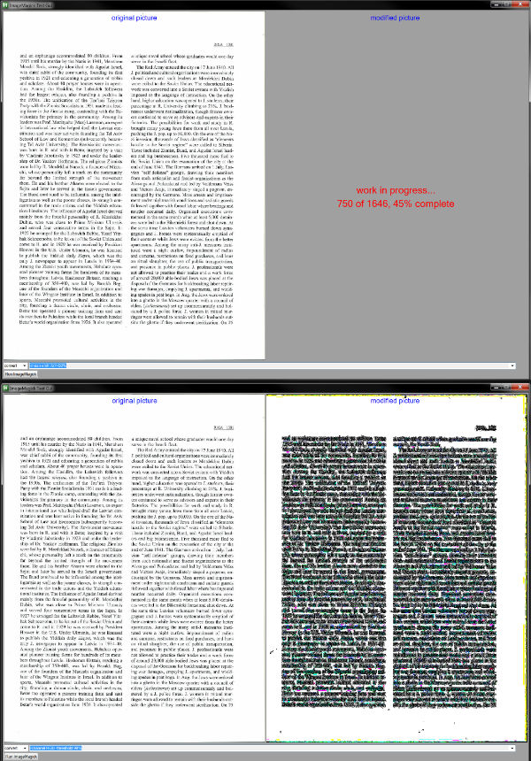

# - - - - - - - - ImageMagickTestGui - - - - - - - - 

a script by Ixiko last change: 27.10.2019

------

***This script is for a quick try of the [Imagemagick command-line tools](https://imagemagick.org/script/command-line-tools.php). On the left it shows the original image and on the right the change is displayed. Complex operations (executing multiple commands one after the other) are not possible. The commands given by the user are stored in the script itself and can be used again the next time.***

------

